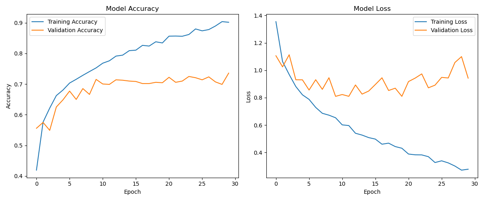
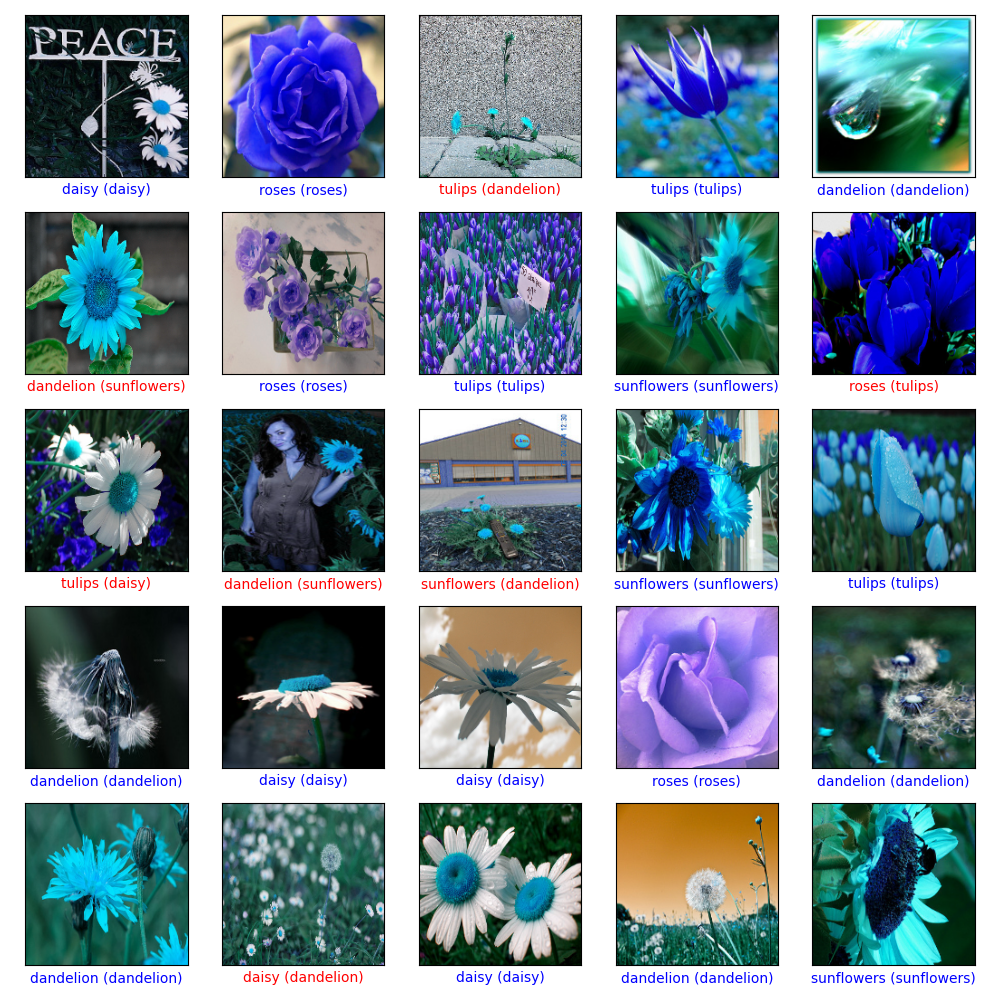

# Flowers Classification with CNNs

This project demonstrates image classification of five types of flowers (roses, daisies, dandelions, sunflowers, and tulips) using a Convolutional Neural Network (CNN) built with TensorFlow and Keras.

## Motivation

I wanted to gain hands-on experience with building CNNs for a multi-class image classification problem, starting from raw images and implementing a complete training and evaluation pipeline.

## Features

- **Data Loading**: Automatically downloads and preprocesses the TensorFlow Flowers dataset.
- **Image Preprocessing**: Uses OpenCV to resize images and normalizes pixel values.
- **Data Augmentation**: Employs `RandomFlip`, `RandomRotation`, and `RandomZoom` to prevent overfitting and improve model generalization.
- **CNN Architecture**: A sequential model featuring multiple convolutional blocks and a dropout layer for regularization.
- **Training and Evaluation**: Trains the model, evaluates its performance on a test set, and saves the trained model.
- **Result Visualization**: Generates and saves plots for training history and visualizes model predictions on test images.

## Dataset

The project automatically downloads the [TensorFlow Flowers dataset](https://storage.googleapis.com/download.tensorflow.org/example_images/flower_photos.tgz), which contains 3,670 images of 5 different flower species.

## Setup

To run this project, you need Python and the following libraries. You can install them using pip:

```bash
pip install tensorflow matplotlib numpy opencv-python scikit-learn
```

## Usage

1. Clone the repository and navigate to the project directory:
   ```bash
   git clone https://github.com/Sat1x/CNN_flowers
   cd /CNN_flowers
   ```

2. Run the script:
   ```bash
   python flowers_cnn.py
   ```

## Outputs

The script will generate the following files in the project directory:
- `flowers_cnn_model.h5`: The saved Keras model after training.(Ended up being too big so was not included in final repo:( )
- `model_performance.png`: A plot showing the training and validation accuracy and loss.
- `predictions.png`: A 5x5 grid of test images with their predicted and true labels.

## Results

### Model Performance
The plot below shows the learning curves for the model's accuracy and loss over 30 epochs.



### Predictions
Here are some example predictions on the test set. Correctly classified images have blue labels, while incorrect ones have red labels. The format is `Predicted (True)`.



 ## Stats
 accuracy: 0.9124 - loss: 0.2494
 val_accuracy: 0.7357 - val_loss: 0.9421

## What I Learned

- How to build an end-to-end image classification pipeline, from data loading to evaluation.
- The importance of data augmentation in improving model robustness, especially with smaller datasets.
- How to use `SparseCategoricalCrossentropy` for integer-based labels.

## Challenges

- Preprocessing a dataset of images with varying sizes and formats.
- Tuning the model architecture and training epochs to achieve a good balance between bias and variance without excessive training time. 
Unlike my cifar10 CNN which took about 30-35 minutes to train on my laptop, this model took just about 15 minutes!

## License

This project is licensed under the MIT License.
